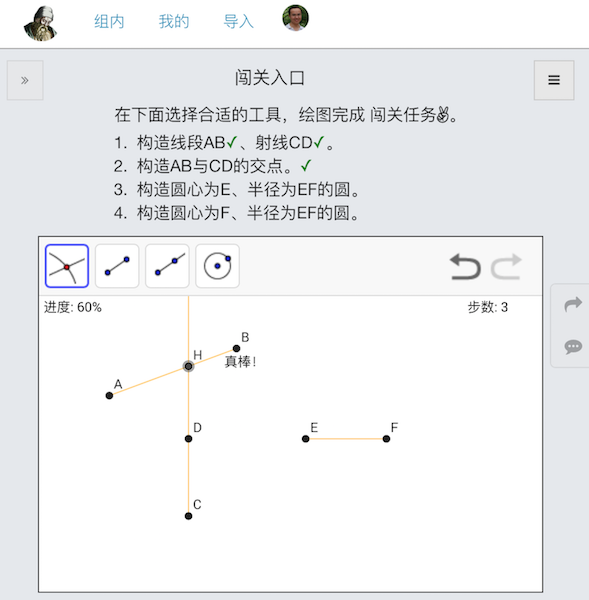

## 基于 GeoGebra 的尺规作图闯关游戏

可参考教程 “[制作GeoGebra闯关游戏][euclid]” 在 “[GeoGebra数学云][site]” 网站制作下列闯关游戏。

可在线体验[闯关游戏][home]，免费注册后可进[闯关排行榜][medals]。

- 闯关入口：[JS](js/0.js) - [HTML](js/0.html) - [CSS](js/0.css) - [GGB](ggb/tutorial.ggb)

- 第一关 - 构造以线段AB为边的正三角形：[JS](js/01.js) - [HTML](js/m.html) - [GGB](ggb/01.ggb)

- 第二关 - 构造线段AB的中点：[JS](js/02.js) - [HTML](js/m.html) - [GGB](ggb/02.ggb)

- 第三关 - 构造角平分线：[JS](js/03.js) - [HTML](js/m.html) - [GGB](ggb/03.ggb)

- 第四关 - 构造过A点且垂直于给定线段的直线或线段：[JS](js/04.js) - [HTML](js/m.html) - [GGB](ggb/04.ggb)

- 第五关 - 构造垂直于给定直线且过B点的直线或线段：[JS](js/05.js) - [HTML](js/m.html) - [GGB](ggb/05.ggb)

- 第六关 - 过B点作一个平行线：[JS](js/06.js) - [HTML](js/m.html) - [GGB](ggb/06.ggb)

- 第七关 - 以C为起点作一个长度和方向都与AB相同的线段：[JS](js/07.js) - [HTML](js/m.html) - [GGB](ggb/07.ggb)

- 第八关 - 以C为起点作一个长度和方向都与AB相同的线段：[JS](js/08.js) - [HTML](js/m.html) - [GGB](ggb/08.ggb)

- 第九关 - 以AB为半径、C为圆心作一个圆(圆规法)：[JS](js/09.js) - [HTML](js/m.html) - [GGB](ggb/09.ggb)

- 第十关 - 构造位于线段CD上的点E，使得CE与AB等长：[JS](js/10.js) - [HTML](js/m.html) - [GGB](ggb/10.ggb)

- 第11关 - 构造边长为指定线段的三角形，以线段AB为第一条边：[JS](js/11.js) - [HTML](js/m.html) - [GGB](ggb/11.ggb)

- 第12关 - 在指定线段的D点上作一个指定角度的新的角度线：[JS](js/12.js) - [HTML](js/m.html) - [GGB](ggb/12.ggb)

- 第13关 - 找到圆的圆心：[JS](js/13.js) - [HTML](js/m.html) - [GGB](ggb/13.ggb)

- 第14关 - 以B点为起点构造一个与圆相切的直线或线段：[JS](js/14.js) - [HTML](js/m.html) - [GGB](ggb/14.ggb)

- 第15关 - 构造三角形的内切圆：[JS](js/15.js) - [HTML](js/m.html) - [GGB](ggb/15.ggb)

- 第16关 - 构造三角形的外接圆：[JS](js/16.js) - [HTML](js/m.html) - [GGB](ggb/16.ggb)

- 第17关 - 作出圆心为O、截距等于AB的圆：[JS](js/17.js) - [HTML](js/m.html) - [GGB](ggb/17.ggb)

- 第18关 - 作出过点A、与直线相切于点B的圆：[JS](js/18.js) - [HTML](js/m.html) - [GGB](ggb/18.ggb)

- 第19关 - 作出半径为AB的两圆，一圆过B点、三圆两两相切：[JS](js/19.js) - [HTML](js/m.html) - [GGB](ggb/19.ggb)

- 第20关 - 作出将指定线段三等分的两个点：[JS](js/20.js) - [HTML](js/m.html) - [GGB](ggb/20.ggb)

- 第21关 - 过点A做圆的两条切线：[JS](js/21.js) - [HTML](js/m.html) - [GGB](ggb/21.ggb)

- 第22关 - 作出以AB为边的正六边形：[JS](js/22.js) - [HTML](js/m.html) - [GGB](ggb/22.ggb)

- 第23关 - 作两圆的外公切线：[JS](js/23.js) - [HTML](js/m.html) - [GGB](ggb/23.ggb)

- 第24关 - 作两圆的内公切线：[JS](js/24.js) - [HTML](js/m.html) - [GGB](ggb/24.ggb)

- 第25关 - 作圆的内接正五边形，顶点在A点：[JS](js/25.js) - [HTML](js/m.html) - [GGB](ggb/25.ggb)

[euclid]: http://rhcad.com/blog/2016/10/euclid/
[site]: http://ggbstudy.top/
[home]: http://ggbstudy.top/#/s/euclid/home
[medals]: http://ggbstudy.top/#/medals/euclid

欢迎Fork试验和改进，讨论可在网上右侧写评论，或加入“GeoGebra学习交流”QQ群`217440999`。